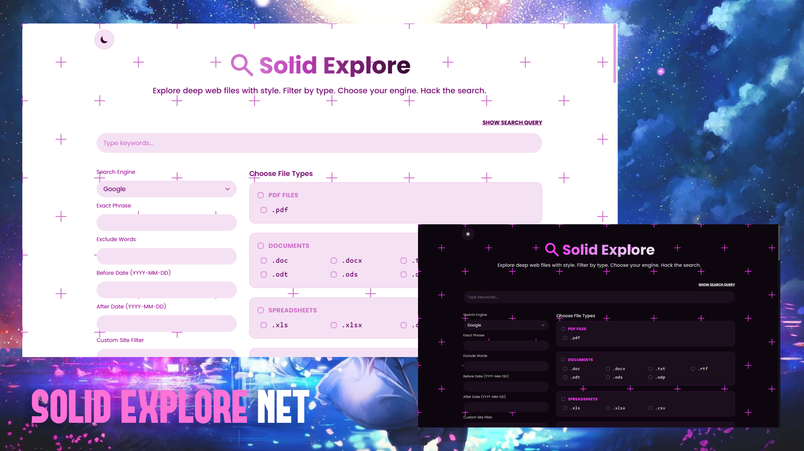
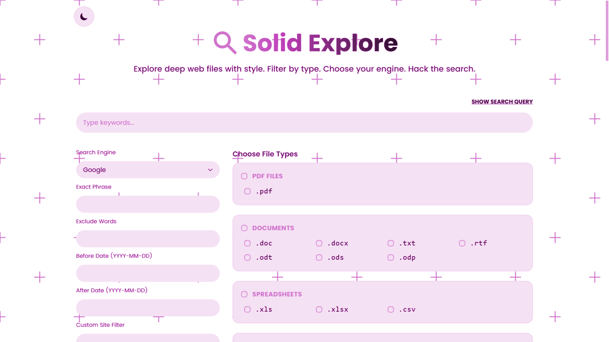
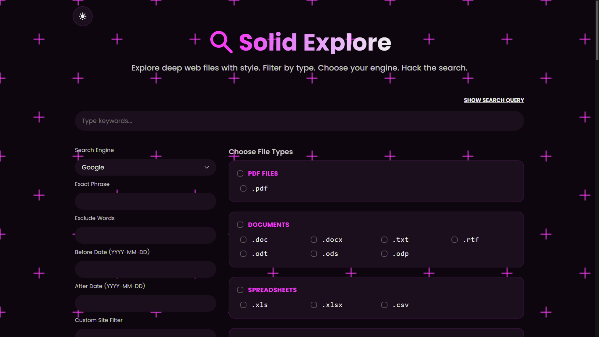

<p align="center">
  
</p>

<h1 align="center">📍Solid Explore</h1>
<p align="center">
  <strong>A modern advanced-search query builder for discovering public web files across multiple search engines.</strong>
</p>

<p align="center">
  
  
  
  
</p>

## Overview

Solid Explore is a browser-based search utility that helps users build advanced search queries with file-type filters, exact phrases, excluded words, domain filters, URL/title operators, and date constraints. Instead of manually typing long search operators, users can select filters from a clean interface and launch the final query in their preferred search engine.

The app is built with the Next.js App Router, React, Tailwind CSS, `next-themes`, and `react-icons`. It includes light/dark styling, custom local fonts, SEO metadata, generated Open Graph image support, PWA manifest data, favicons, screenshots, and branded visual assets.

## Screenshots

<p align="center">
  
  
</p>

## Features

- Build advanced search queries from a guided UI.
- Search with 20+ supported engines, including Google, Bing, DuckDuckGo, Brave, Startpage, Qwant, Yahoo, Ecosia, Yandex, Baidu, and more.
- Enter regular keyword searches.
- Add an exact phrase using quoted search syntax.
- Exclude words with negative search operators.
- Filter by domain or custom site using `site:`.
- Search inside URLs with `inurl:`.
- Search inside page titles with `intitle:`.
- Add `before:` and `after:` date filters.
- Select one or many file extensions from grouped categories.
- Add a custom single file extension when presets are not enough.
- Preview the generated query before launching it.
- Open the final encoded query in a new browser tab.
- Toggle light and dark mode.
- Use a responsive layout for desktop and smaller screens.
- Include custom Poppins and Anada fonts.
- Include favicon, app icon, manifest, sitemap, and generated Open Graph image setup.
- Include custom error, global error, and not-found pages.

## File Type Categories

Solid Explore includes preset extension groups for:

- PDF files
- Documents
- Spreadsheets
- Text files
- Presentations
- Archives
- Password and login related files
- Database files
- Log files
- Configuration files
- Backup files
- Executables and installers
- Code and script files
- Media files
- Design files
- System files
- Font files
- Temporary files
- Package manager files
- License files
- Encrypted files
- System logs
- Email files

## Search Engines

The current engine list includes:

| Engine | Purpose |
| --- | --- |
| Google | General web search |
| Bing | General web search |
| DuckDuckGo | Privacy-focused search |
| Yandex | General web search |
| Baidu | General web search |
| Brave | Privacy-focused search |
| Startpage | Google-backed privacy search |
| Qwant | Privacy-focused search |
| Mojeek | Independent search |
| Swisscows | Privacy-focused search |
| Gibiru | Privacy-focused search |
| You | AI/search assistant style search |
| Yahoo | General web search |
| AOL | General web search |
| Ecosia | Search engine with climate-focused branding |
| MetaGer | Meta-search |
| Searx | Open-source meta-search instance |
| Presearch | Decentralized search |
| Neeva | Legacy entry kept in the list |
| InfinitySearch | Search engine entry |
| Yep | Search engine by Ahrefs |
| OneSearch | General search entry |

## Tech Stack

| Area | Technology |
| --- | --- |
| Framework | Next.js 15 App Router |
| UI Library | React 19 |
| Styling | Tailwind CSS 4 |
| Theme Handling | next-themes |
| Icons | react-icons |
| Animation/UX Dependencies | Framer Motion, GSAP, AOS |
| Content/Markdown Dependencies | gray-matter, react-markdown, react-syntax-highlighter |
| Media/UI Dependencies | Swiper, react-simple-typewriter |
| Image Optimization | Next Image, Sharp |

## Project Structure
```text
solid-explore/
├── public/
│   ├── android-chrome-192x192.png
│   ├── android-chrome-512x512.png
│   ├── apple-touch-icon.png
│   ├── assets/
│   │   ├── fonts/
│   │   ├── images/
│   │   │   └── lines/
│   │   └── sounds/
│   ├── favicon-16x16.png
│   ├── favicon-32x32.png
│   └── favicon.ico
├── screenshots/
│   ├── dark.png
│   └── light.png
├── src/
│   ├── app/
│   │   ├── (main)/
│   │   │   └── page.js
│   │   ├── error.js
│   │   ├── global-error.js
│   │   ├── layout.js
│   │   ├── manifest.js
│   │   ├── not-found.js
│   │   ├── opengraph-image.js
│   │   └── sitemap.js
│   ├── components/
│   │   ├── error/
│   │   ├── home/
│   │   └── layout/
│   ├── data/
│   │   ├── global.js
│   │   └── navigations.js
│   └── styles/
│       └── globals.css
├── banner.png
├── package.json
└── README.md
```

## Getting Started

### Prerequisites

- Node.js 20 or newer
- npm

### Installation

```bash
git clone <repository-url>
cd solid-explore
npm install
```

### Development

```bash
npm run dev
```

Open `http://localhost:3000` in your browser.

### Production Build

```bash
npm run build
npm run start
```

### Linting

```bash
npm run lint
```

## Available Scripts

| Command | Description |
| --- | --- |
| `npm run dev` | Starts the local development server with Turbopack. |
| `npm run build` | Creates a production build. |
| `npm run start` | Starts the production server. |
| `npm run lint` | Runs the configured Next.js lint command. |

## How To Use

1. Enter your main keywords.
2. Select a search engine.
3. Add optional filters such as exact phrase, excluded words, domain, URL text, title text, and dates.
4. Choose one or more file-type categories or individual file extensions.
5. Use **Show Search Query** to preview the generated operator query.
6. Click **Search Now** to open the query in a new tab.

## Query Operators

Solid Explore builds queries using common search operators:

| UI Field | Generated Syntax |
| --- | --- |
| Exact Phrase | `"your phrase"` |
| File Type | `filetype:pdf` |
| Exclude Words | `-word` |
| Domain Filter | `site:example.com` |
| In URL | `inurl:keyword` |
| In Title | `intitle:keyword` |
| Before Date | `before:YYYY-MM-DD` |
| After Date | `after:YYYY-MM-DD` |

## Notes

- Solid Explore does not host, index, scrape, or store files.
- It builds search-engine URLs from user-selected filters.
- Search result quality depends on the selected search engine and supported operators.
- Some engines may ignore certain operators or handle them differently.
- The `Neeva` entry is present in the engine list even though the public Neeva search product has been discontinued.

## Deployment

This project can be deployed to Vercel or any platform that supports Next.js.

For Vercel:

1. Push the project to a Git repository.
2. Import the repository in Vercel.
3. Keep the default Next.js build settings.
4. Deploy.

## License

This project is licensed under the MIT License. See [LICENSE](LICENSE) for details.

## Author

Ashish Kumar
